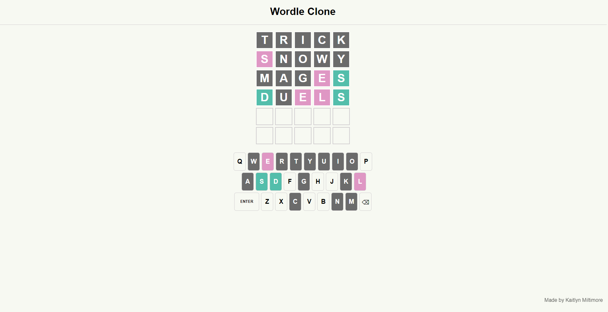

# Wordle-Game

## About
This game is a clone of the game "Wordle" and has a very similar setup and functionality. The game involves guessing a 5 letter word within 6 tries, while providing the user with hints through colours.
There are two versions of the game in this repository:
- Version 1 (v01) which is the game created in HTML, CSS, and JavaScript.
- Version 2 (v02) which is the game created in HTML, CSS, JavaScript, and PHP to create a leaderboard that stores the top 10 scores for the session.

## How to Play
Similar to the NY Times Wordle game, this clone gives hints to the user on what the correct word is by changing the colours of the letters to three different colours: grey, pink, and turquoise.

### What do these Colours Mean?
- Grey letters mean that the letter entered is NOT present in the solution.
- Pink letters mean that the letter entered IS present in the solution, but not in the place it was entered.
- Turquoise letters mean that the letter entered IS present in the solution AND it is in the correct place.

#### See the below screenshot for an idea:
In this particular frame, we can see that D and S (turquoise) are correctly placed in the word, and that E and L (pink) are also in the word but are not currently in the correct positions. All other letters previously guessed in grey are NOT in the word.

### Status Popups
When the user wins the game, enters an invalid word, or does not guess the word in six tries, they will be given one of the three popups:
- "Not in word list!" This popup appears when the user has entered a word that is not a valid 5 letter word in the English dictionary.
- "Impressive!" This popup appears when the user has correctly guessed the word.
- "The correct word was: __" This popup appears when the user does not guess the word in six tries.