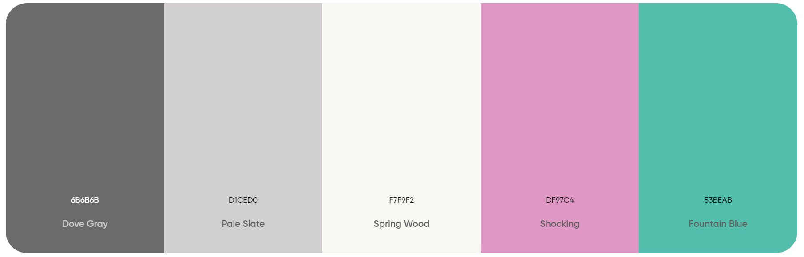
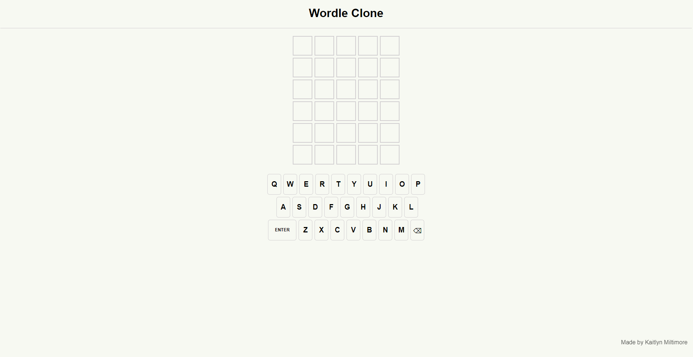
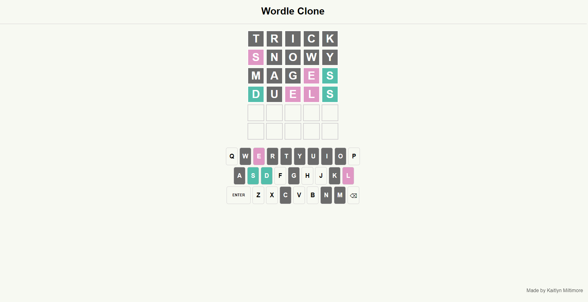
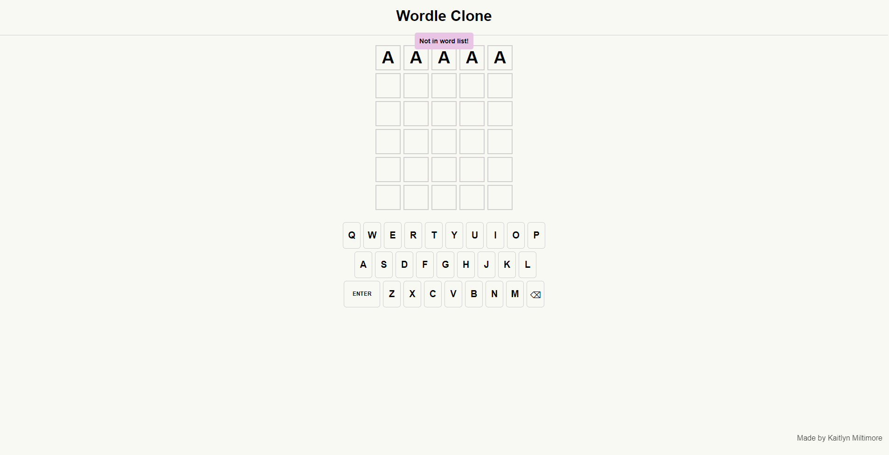
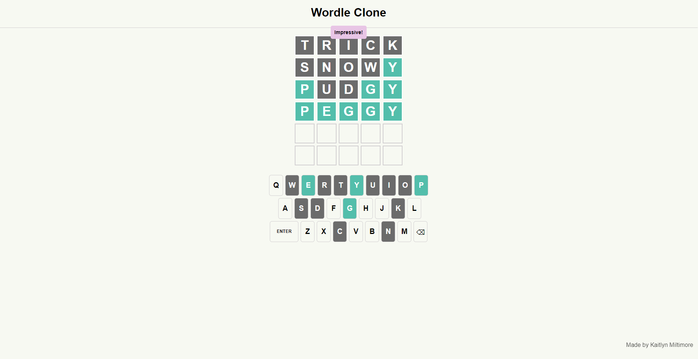
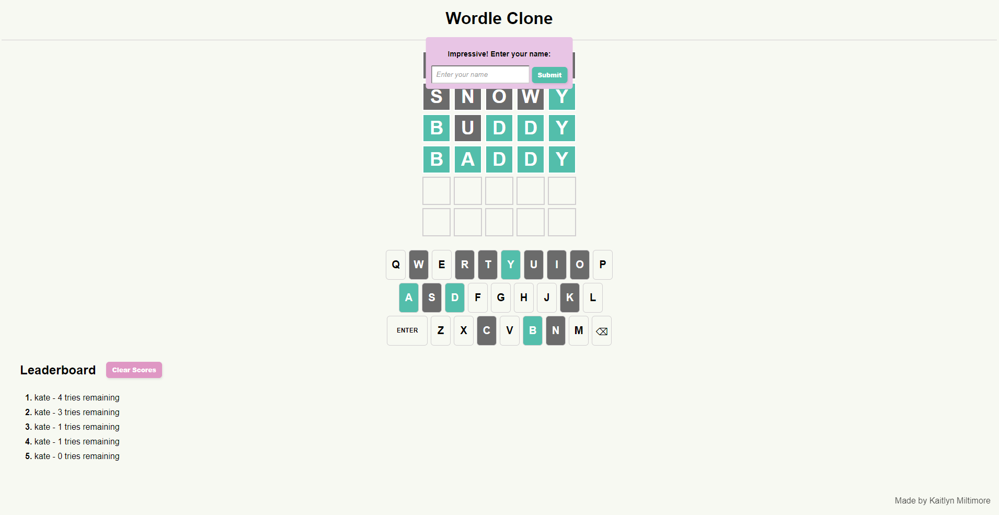

# Documenting the Design

## Fonts/Sizes:
- All text is presented in Arial, sans-serif and bolded.
- The text in the letter boxes is 20px (except for the ENTER button which is 12px).

## Colour Palette:
- For the letter boxes and keyboard buttons, 3 colours were used to distinguish between the correctness of the user's guesses: #53beab (turqoise) for correctly placed letters, #df97c4 (pink) for letters that are not placed correctly, and #6b6b6b (grey) for letters that are not in the solution.
- For the letter boxes themselves, #d1ced0 (light grey) was used for the borders.
- This same colour, #d1ced0, was also used for the borders around the keyboard buttons.
- The background colour is a slightly off white colour, #f7f9f2.
- All text is in black, except for when the user makes guesses and the box/keyboard button colours change, then the text becomes white so that it can be seen.

## Major Game Components:

### Starting a Game
- Upon opening the window, the user sees all empty boxes (with no colour) and all of the keyboard buttons have no colour yet.

### In Game Play
- As the user starts making guesses, the letter boxes and keyboard buttons will change colours depending on the correctness of their guesses, as explained in the colour palette section.
- The user can either type in their guesses or press on the keyboard buttons to enter them.

### Game Scenarios

Not a Word
- When the user enters a word that is not in the valid words list, they will receive a popup informing them of this.

Win
- When the user guesses the word correctly, they will receive a popup saying "Impressive!"

Lose
- When the user does not guess the word correctly after 6 tries, they will receive a popup providing them with the correct answer.

### Leaderboard

In Version 2 of the game, a leaderboard showing the top 10 scores for the current session is displayed using a PHP server. This leaderboard sorts the scores based on how many tries left the user has, making the top score the user with the most tries remaining. Upon finishing the game, whether the user wins or loses, the user will be prompted to enter their name to submit their score. This leaderboard can be cleared by the user by pressing the "Clear Scores" button beside the board.
